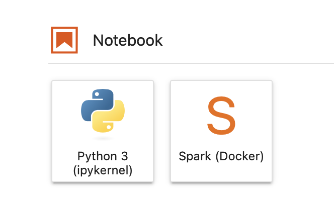

# spark-delta-jupyter

This builds a spark image with delata on it. It's being used to test spark setup. The image contains the following

| Name        | Version     |
|  :----:     |  :----:     |
| Java        | 17          |
| Python      | 3.11        |
| Spark       | 3.3.1       |
| Delta       | 2.2.0       |

There is an additional image that is also built with Jupyterhub (with Jupyterlab) on it. This is to enable testing.

The jupyterhub has a preconfigured kernel to connect to spark docker image.

# How to use 

## TL;DR

```shell
wget https://raw.githubusercontent.com/parj/spark-delta-jupyter/main/docker-compose.yaml
docker-compose up -d
```
Head to http://localhost:8000/. User is `spark` and there is no password

---


## The longer version


Download the file -> https://raw.githubusercontent.com/parj/spark-delta-jupyter/main/docker-compose.yaml

Run `docker-compose up -d`. 

This will start:
* Spark Master
* 1 Spark worker
* Thrift server 
* Jupyterhub

> **Note**
> Ensure there are enough cores set in Docker settings (min. of 4).

Connect to jupyterhub - http://localhost:8000/ .

Login details
* User - `spark`
* Password - leave it blank

In notebook, select Spark (Docker)



Example code to connect to spark

```python
from pyspark.sql import SparkSession

spark = SparkSession.builder \
        .appName("delta") \
        .getOrCreate()
```

If you prefer just to have a standard Python 3 kernel, the code to connect

```python
from pyspark.sql import SparkSession

spark = SparkSession.builder \
        .master("spark://master:7077") \
        .appName("delta") \
        .config("spark.sql.extensions", "io.delta.sql.DeltaSparkSessionExtension") \
        .config("spark.sql.catalog.spark_catalog", "org.apache.spark.sql.delta.catalog.DeltaCatalog") \
        .getOrCreate()

```

## Delta

For testing delta - there is a shared volume created by docker-compose. The shared volume is mount on spark worker and jupyterhub. Delta requires read-write from the driver and worker.

```python
#Write test
data = spark.range(0, 5)
data.write.format("delta").save("/workspace/delta-table")

#Read test
df = spark.read.format("delta").load("/workspace/delta-table")
df.show()
```

## To build

### Spark

`docker build -t spark:331 ./spark/`

### Jupyterhub

`docker build -t jupyterhub:331 ./jupyterhub/`
